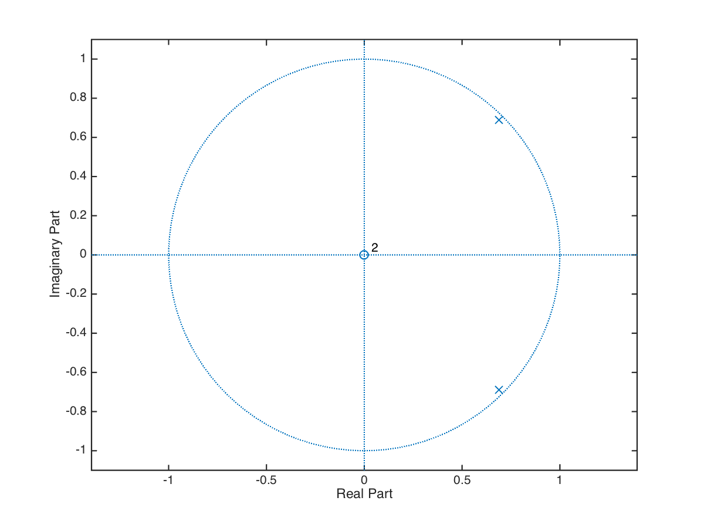
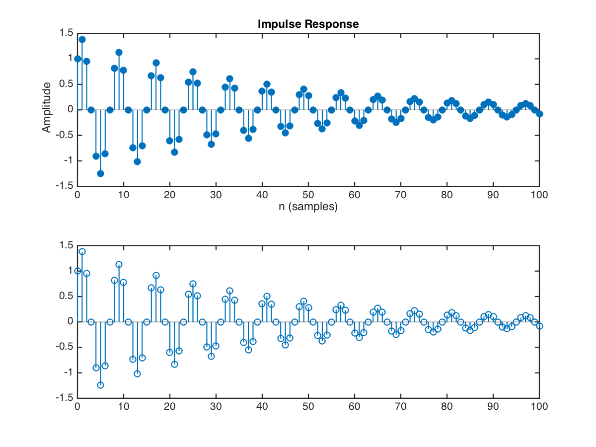
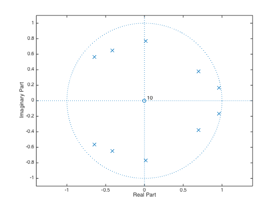
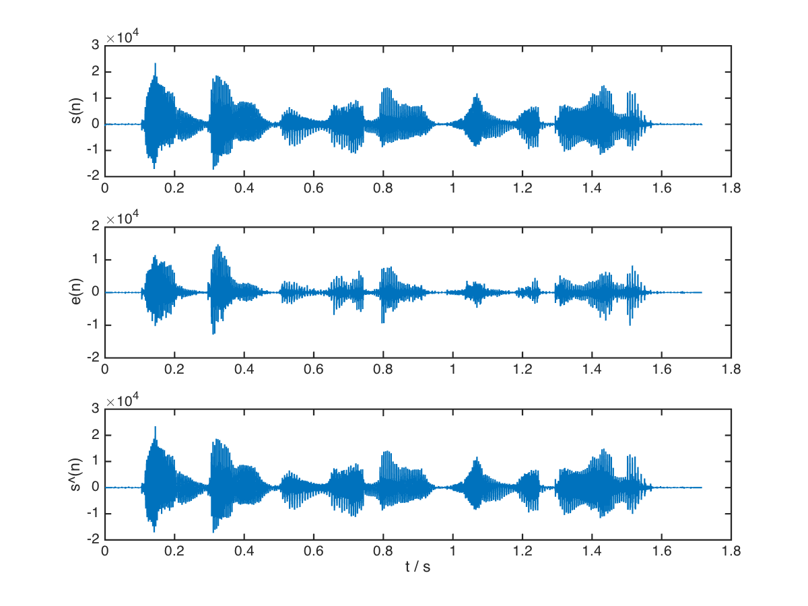
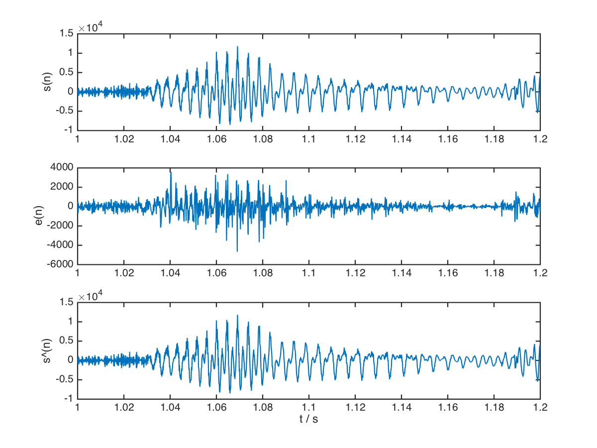

# 语音合成综合实验

## 1. 语音预测模型

### 1.1 分析滤波器

    e(n) = s(n) - a1 * s(n - 1) - a2 * s(n - 2)

由 Z 变换可以直接得到传递函数：

    H(z) = 1 / (1 - a1 * z^-1 - a2 * z^-2)

用 `zplane`, `freqz`, `impz` 分别绘出零极点分布图，频率响应和单位样值响应，并用 `filter` 函数画出单位样值响应：

```matlab
close all

a = [1, -1.3789, 0.9506];
b = 1;
n = [0:100];
x = (n == 0);
f_sample = 8000;

zplane(b, a);
saveas(gcf, '../report/zplane', 'png');

figure
[H, F] = freqz(b, a, 512, f_sample);
[max_value, max_index] = max(H);
fprintf('Formant = %.2f Hz\n', F(max_index));

saveas(gcf, '../report/freqz', 'png');

figure
subplot 211
impz(b, a, n);
subplot 212
y = filter(b, a, x);
stem(n, y);
saveas(gcf, '../report/impz_filter', 'png');
```

输出：

    Formant = 1000.00 Hz






可以看到，通过 `impz` 和 `filter` 得到的单位样值响应没有区别。

### 1.2 理解 `speechproc.m` 的基本流程

基本的流程如下：

1. 载入语音信号；
2. 对语音信号的每一帧做如下操作：
    1. 计算该帧的预测系数；
    2. 利用语音预测模型计算该帧激励信号；
    3. 利用语音重建模型，使用激励信号计算该帧的重建语音；
    4. 计算该段 PT 和合成激励的能量，并用其生成合成激励，生成语音；
    5. 用增长的合成激励生成语音，变速不变调；
    6. 减小基音周期，增大谐振峰，合成语音，变调不变速；
3. 保存所有激励和语音；

其中 PCM 文件中数据都是以 `int16` 的形式保存的。

### 1.3 观察 27 帧时的零极点分布

直接调用 `zplane` 即可：

```matlab
if n == 27
    % (3) 在此位置写程序，观察预测系统的零极点图
    zplane(1, A);
end
```

结果如图，一共有 5 对共轭的极点。



### 1.4 计算激励信号 `e(n)`

利用原先代码中计算好的预测系数，可以直接使用 `filter` 函数计算出 `e(n)`。

需要注意的是，为了在系数变化的情况下连续滤波，应该将滤波器的状态保存在 `zi_pre` 中。代码如下：

```matlab
% (4) 在此位置写程序，用filter函数s_f计算激励，注意保持滤波器状态
[exc((n-1)*FL+1:n*FL), zi_pre)] = filter(A, 1, s_f, zi_pre);
```

### 1.5 重建语音信号 `s^(n)`

与上题一样，只要将 `filter` 函数的 `A`, `B` 参数对调，将 `e(n)` 作为输入传入，同时将状态保存在 `zi_rec` 中即可。代码如下：

```matlab
[s_rec((n-1)*FL+1:n*FL), zi_rec] = ...
    filter(1, A, exc((n-1)*FL+1:n*FL), zi_rec);
```

### 1.6 对比 `s(n)`, `e(n)`, `s^(n)`

先试听

```matlab
% (6) 在此位置写程序，听一听 s ，exc 和 s_rec 有何区别，解释这种区别
% 后面听语音的题目也都可以在这里写，不再做特别注明
sound(s);
pause(2);
sound(exc);
pause(2);
sound(s_rec);
```

可以听出来，`s(n)` 和 `s^(n)` 几乎没有区别，都是带有杂音的“电灯比油灯进步多了”；而 `e(n)` 信号听起来虽然也是这句话，但是话的音量变小了不少，杂音也变得很重。

这是因为 `s^(n)` 信号几乎是 `s(n)` 的复原，而 `e(n)` 信号则是原声音减去预测值之后的残差。所以，能较好符合发声模型的部分（人声）被大幅减弱，而不能很好被模型预测的部分（噪声）便占据了主导地位。这个现象的存在说明预测模型是成功的，能够起到压缩信息的作用。

将这三个信号画出：

```matlab
t = [0:L-1] / 8000;

figure
subplot 311
plot(t, s);
ylabel s(n)

subplot 312
plot(t, exc);
ylabel e(n)

subplot 313
plot(t, s_rec);
xlabel 't / s'
ylabel s\^(n)
```



从图上可以看出，`s^(n)` 和 `s(n)` 几乎没有区别，而 `e(n)` 的波形虽然在形状上相近，但幅度有明显的减小（注意中图纵坐标比例与上下两图不一样），而且波形显得“干瘦”了不少。这正是预测模型有效的标志。

取 1 ~ 1.2s 处的波形：

```matlab
t_range = (t > 1 & t < 1.2);

figure
subplot 311
plot(t(t_range), s(t_range));
ylabel s(n)

subplot 312
plot(t(t_range), exc(t_range));
ylabel e(n)

subplot 313
plot(t(t_range), s_rec(t_range));
xlabel 't / s'
ylabel s\^(n)
```



可以看到，`e(t)` 的波形已经趋近于噪声，周期明显的人声部分已经基本被滤去。

## 2. 语音合成模型

### 2.1

### 2.2

### 2.3

### 2.4

## 3. 变速不变调

### 3.1

### 3.2

## 4. 变调不变速

### 4.1

### 4.2
