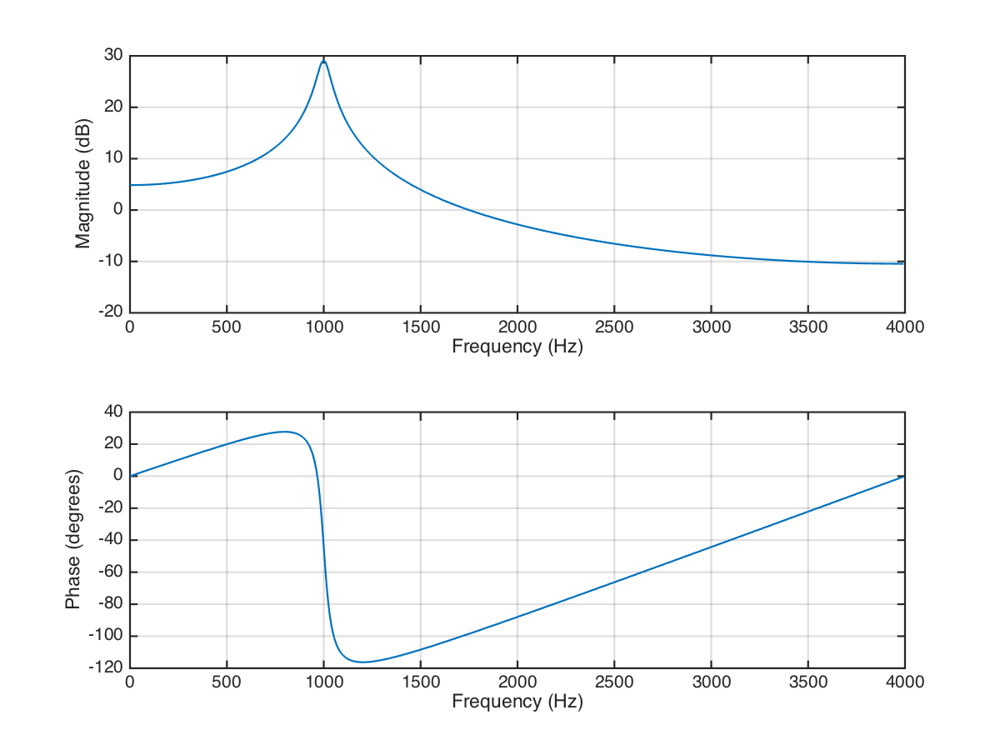

# 语音合成综合实验

## 1. 语音预测模型

### 1.1 分析滤波器

    e(n) = s(n) - a1 * s(n - 1) - a2 * s(n - 2)

由 Z 变换可以直接得到传递函数：

    H(z) = 1 / (1 - a1 * z^-1 - a2 * z^-2)

用 `zplane`, `freqz`, `impz` 分别绘出零极点分布图，频率响应和单位样值响应，并用 `filter` 函数画出单位样值响应：

```matlab
close all

a = [1, -1.3789, 0.9506];
b = 1;
n = [0:100];
x = (n == 0);
f_sample = 8000;

zplane(b, a);
saveas(gcf, '../report/zplane', 'png');

figure
[H, F] = freqz(b, a, 512, f_sample);
[max_value, max_index] = max(H);
fprintf('Formant = %.2f Hz\n', F(max_index));

saveas(gcf, '../report/freqz', 'png');

figure
subplot 211
impz(b, a, n);
subplot 212
y = filter(b, a, x);
stem(n, y);
saveas(gcf, '../report/impz_filter', 'png');
```

输出：

    Formant = 1000.00 Hz





可以看到，通过 `impz` 和 `filter` 得到的单位样值响应没有区别。

### 1.2 理解 `speechproc.m` 的基本流程

基本的流程如下：

1. 载入语音信号；
2. 对语音信号的每一帧做如下操作：
    1. 计算该帧的预测系数；
    2. 利用语音预测模型计算该帧激励信号；
    3. 利用语音重建模型，使用激励信号计算该帧的重建语音；
    4. 计算该段 PT 和合成激励的能量，并用其生成合成激励，生成语音；
    5. 用增长的合成激励生成语音，变速不变调；
    6. 减小基音周期，增大谐振峰，合成语音，变调不变速；
3. 保存所有激励和语音；

其中 PCM 文件中数据都是以 `int16` 的形式保存的。

### 1.3 观察 27 帧时的零极点分布

直接调用 `zplane` 即可：

```matlab
if n == 27
    % (3) 在此位置写程序，观察预测系统的零极点图
    zplane(1, A);
end
```

结果如图，一共有 5 对共轭的极点。


### 1.4 计算激励信号 `e(n)`

利用原先代码中计算好的预测系数，可以直接使用 `filter` 函数计算出 `e(n)`。

需要注意的是，为了在系数变化的情况下连续滤波，应该将滤波器的状态保存在 `zi_pre` 中。代码如下：

```matlab
% (4) 在此位置写程序，用filter函数s_f计算激励，注意保持滤波器状态
[exc((n-1)*FL+1:n*FL), zi_pre)] = filter(A, 1, s_f, zi_pre);
```

### 1.5 重建语音信号 `s^(n)`

与上题一样，只要将 `filter` 函数的 `A`, `B` 参数对调，将 `e(n)` 作为输入传入，同时将状态保存在 `zi_rec` 中即可。代码如下：

```matlab
[s_rec((n-1)*FL+1:n*FL), zi_rec] = ...
    filter(1, A, exc((n-1)*FL+1:n*FL), zi_rec);
```

### 1.6 对比 `s(n)`, `e(n)`, `s^(n)`

先试听

```matlab
% (6) 在此位置写程序，听一听 s ，exc 和 s_rec 有何区别，解释这种区别
% 后面听语音的题目也都可以在这里写，不再做特别注明
f_sample = 8000;
sound(s / max(abs(s)), f_sample);
pause(2);
sound(exc / max(abs(exc)), f_sample);
pause(2);
sound(s_rec / max(abs(s_rec)), f_sample);
```

可以听出来，`s(n)` 和 `s^(n)` 几乎没有区别，都是清晰的的“电灯比油灯进步多了”；而 `e(n)` 信号听起来虽然也是这句话，但是话的音量变小了不少，杂音的相对大小也增大了。

这是因为 `s^(n)` 信号几乎是 `s(n)` 的复原，而 `e(n)` 信号则是原声音减去预测值之后的残差。所以，能较好符合发声模型的部分（人声）被大幅减弱，而不能很好被模型预测的部分（噪声）便占据了主导地位。这个现象的存在说明预测模型是成功的，能够起到压缩信息的作用。

将这三个信号画出：

```matlab
t = [0:L-1] / f_sample;

figure
subplot 311
plot(t, s);
ylabel s(n)

subplot 312
plot(t, exc);
ylabel e(n)

subplot 313
plot(t, s_rec);
xlabel 't / s'
ylabel s\^(n)
```


从图上可以看出，`s^(n)` 和 `s(n)` 几乎没有区别，而 `e(n)` 的波形虽然在形状上相近，但幅度有明显的减小（注意中图纵坐标比例与上下两图不一样），而且波形显得“干瘦”了不少。这正是预测模型有效的标志。

取 1 ~ 1.2s 处的波形：

```matlab
t_range = (t > 1 & t < 1.2);

figure
subplot 311
plot(t(t_range), s(t_range));
ylabel s(n)

subplot 312
plot(t(t_range), exc(t_range));
ylabel e(n)

subplot 313
plot(t(t_range), s_rec(t_range));
xlabel 't / s'
ylabel s\^(n)
```


可以看到，`e(t)` 的波形已经趋近于噪声，周期明显的人声部分已经基本被滤去。

## 2. 语音合成模型

### 2.1 生成单位样值“串”

从表达式中可以看出：

    N = floor(f_sample / f)
    NS = f

故可以写出生成函数如下：

```matlab
%% gen_sample_sig: Generate sample signal.
function sig = gen_sample_sig(f, f_sample, duration)
    period = floor(f_sample / f);
    t = [1 : f_sample * duration]';
    sig = double(mod(t, period) == 0);
```

测试 200 Hz 和 300 Hz 的单位样值“串”：

```matlab
f_sample = 8000;
duration = 1;

sound(gen_sample_sig(200, f_sample, duration), f_sample);
pause(duration + 1);  % Make a 1s interval.
sound(gen_sample_sig(300, f_sample, duration), f_sample);
```

两个音听起来都像是单音，其中 300 Hz 的音（毫不意外地）听起来更高一些。

### 2.2 生成分段单位样值信号

为了生成分段单位样值信号，我们重新实现 2.1 中实现过的 `gen_sample_sig` 函数。实现方法为：记录当前所处的位置，每次循环将当前位置处信号置为 1，同时根据当前位置算出要向前移动的距离，直到完全生成出信号。具体代码实现如下：

```matlab
%% gen_sample_sig: Generate sample signal.
function sig = gen_sample_sig(f_sample, duration, t_total)
    pos = 1;
    part_len = floor(f_sample * duration);
    sig_len = floor(f_sample * t_total);
    sig = zeros(sig_len, 1);

    while pos <= sig_len
        sig(pos) = 1;
        m = ceil(pos / part_len) - 1;  % Assume start from part 0.
        pos = pos + 80 + 5 * mod(m, 50);
    end
```

生成信号（假设段序号从 0 开始）：

```matlab
sig = gen_sample_sig(f_sample, 0.01, 1);
sound(sig, f_sample);
```

`sig` 信号：


听起来像是在 0 和 0.5s 附近开始发出两个音的激励。

### 2.3 用 2.2 中的 `e(n)` 生成 `s(n)`

直接用 1.1 中的系统进行滤波。

注意播放前需要将信号最大值化为 1，否则会被 `sound` 函数截去。

```matlab
s = filter(1, [1, -1.3789, 0.9506], sig);
sound(s / max(abs(s)), f_sample);  % Make sure s won't be clipped by `sound`.
```


听起来像是喉咙发出的声音，有点像“啊啊”。

### 2.4 利用合成激励信号生成合成语音

为了利用 PT 生成合成激励信号，我们沿用 2.2 中的思路，使用 `pos_syc` 变量来保存当前的位置，同时加入滤波器的状态变量。

```matlab
zi_syn = zeros(P,1);
pos_syc = 2 * FL + 1;  % Initial pos.
```

然后便可以用同样的思路生成合成激励，并产生合成语音：

```matlab
% (10) 在此位置写程序，生成合成激励，并用激励和filter函数产生合成语音
while pos_syc <= n * FL
    exc_syn(pos_syc) = G;
    pos_syc = pos_syc + PT;
end

[s_syn((n-1)*FL+1:n*FL), zi_syn] = ...
    filter(1, A, exc_syn((n-1)*FL+1:n*FL), zi_syn);
```

最后将合成语音播放出来：

```matlab
sound(s_syn / max(abs(s_syn)), f_sample);
```

合成语音听起来也是 “电灯比油灯进步多了”，不过声音似乎不是特别自然。二者的波形比较如下：


可以看到，二者的包络已经十分相近了，不过具体的波形仍然有比较明显的差异。

## 3. 变速不变调

### 3.1 减慢一倍速度

我们沿用 2.4 中的思路，加入位置变量和滤波器状态变量：

```matlab
zi_syn_v = zeros(P,1);
pos_syc_v = 4 * FL + 1;   % Initial pos.
```

生成长度增大一倍后的合成激励后生成合成语音：

```matlab
% (11) 不改变基音周期和预测系数，将合成激励的长度增加一倍，再作为filter
% 的输入得到新的合成语音，听一听是不是速度变慢了，但音调没有变。
while pos_syc_v <= 2 * n * FL
    exc_syn_v(pos_syc_v) = G;
    pos_syc_v = pos_syc_v + PT;
end

[s_syn_v(2*(n-1)*FL+1:2*n*FL), zi_syn_v] = ...
    filter(1, A, exc_syn_v(2*(n-1)*FL+1:2*n*FL), zi_syn_v);
```

播放变速后的合成语音：

```matlab
sound(s_syn_v / max(abs(s_syn_v)), f_sample);
```

合成出的语音确实速度减慢了一倍，但音调没有变化。不过，原本 2.4 中就出现了的颤音也被明显拖长了，所以放慢后的语音显得更不真实了一些。

波形对比如图所示：


## 4. 变调不变速

### 4.1 提高 1.1 中系统谐振峰

为了能够提高系统的谐振峰，我们先用 `roots` 函数算出系统的极点，然后将上半平面的极点逆时针旋转，下班平面的极点逆时针旋转。旋转的弧度则由下公式给出：

    θ = 2π * f_delta / f_sample

最后，再通过 `poly` 函数恢复成系统参数。代码实现如下：

```matlab
%% adjust_peak: Adjust the peak of a system
function [adjusted] = adjust_peak(A, f_sample, f_delta)
    poles = roots(A);
    upside =   (imag(poles) > 0);
    downside = (imag(poles) < 0);

    theta = f_delta / f_sample * 2 * pi;
    poles(upside)   = poles(upside)   * (cos(theta) + i * sin(theta));
    poles(downside) = poles(downside) * (cos(theta) - i * sin(theta));

    adjusted = poly(poles);
```

对 1.1 中的系统应用该函数：

```matlab
A = adjust_peak([1, -1.3789, 0.9506], 8000, 150)

% A =
%
%     1.0000   -1.2073    0.9506
```

从而得到 `a1 = 1.2073, a2 = -0.9506`。

查看谐振峰：

```matlab
freqz(1, A, 512, 8000);
```


可以看到，谐振峰确实提高了 150 Hz。

### 4.2 合成语音变调不变速

我们（毫无意外地继续）沿用 2.4 中的思路，使用 `pos_syc_t` 变量来保存当前的位置，同时加入滤波器的状态变量。

```matlab
zi_syn_t = zeros(P,1);
pos_syc_t = 2 * FL + 1;   % Initial pos.
```

然后便可以（还是用）用同样的思路生成合成激励，并产生合成语音：

```matlab
% (10) 在此位置写程序，生成合成激励，并用激励和filter函数产生合成语音
while pos_syc_t <= n * FL
    exc_syn_t(pos_syc_t) = G;
    pos_syc_t = pos_syc_t + ceil(PT / 2);  % Use ceil ensure offset > 0.
end

[s_syn_t((n-1)*FL+1:n*FL), zi_syn_t] = ...
    filter(1, adjust_peak(A, f_sample, 150), ...
           exc_syn_t((n-1)*FL+1:n*FL), zi_syn_t);
```

最后（正如你所预期的那样）将合成语音播放出来：

```matlab
sound(s_syn_t / max(abs(s_syn_t)), f_sample);
```

合成语音（自然而然地）也是 “电灯比油灯进步多了”，不过这一次听起来有点像女性的声音 orz。

我们来看一下第 27 帧时的零极点分布变化：


可以看到，调整过后系统的极点确实转动了一个角度。这也是共振峰频率增加的标志。
